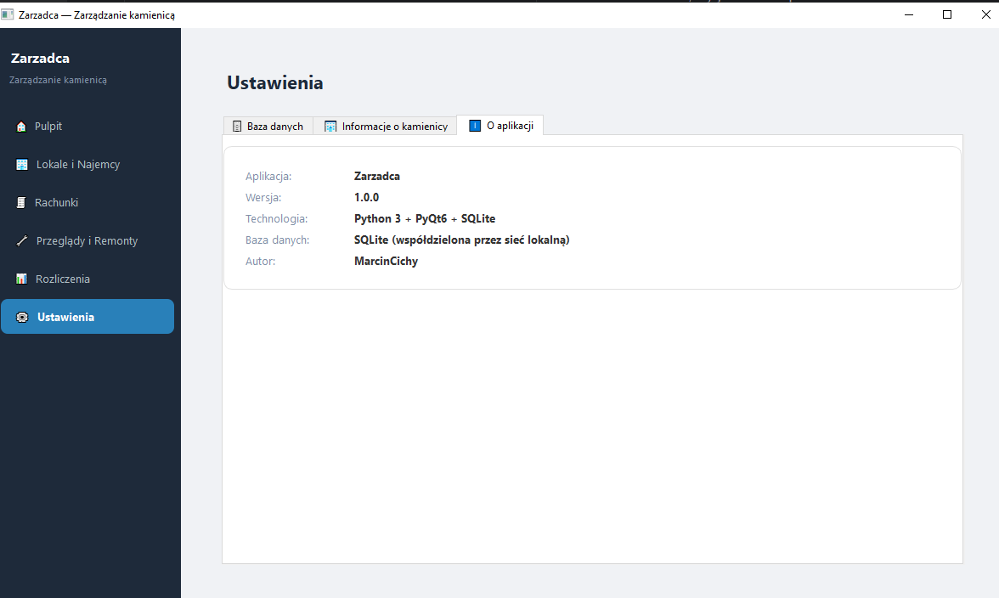
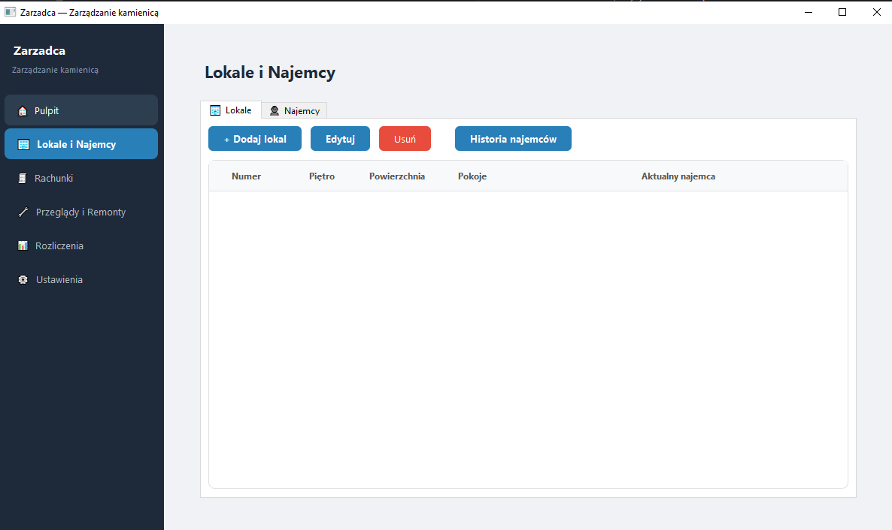

# Zarządca

Desktopowa aplikacja do zarządzania nieruchomościami na wynajem (kamienice,
mieszkania i inne lokale): lokale, najemcy, rachunki, przeglądy, remonty,
waloryzacja czynszu, rozliczenia ze współwłaścicielami oraz kopie zapasowe
bazy.

## Funkcje

### Pulpit

Strona startowa z kartami podsumowującymi liczbę lokali, aktywnych najemców,
rachunki z bieżącego miesiąca, zaległości oraz zbliżające się przeglądy.

### Lokale i Najemcy

- Ewidencja lokali: numer, piętro, powierzchnia, liczba pokoi i opis.
- Domyślne stawki lokalu: czynsz, prąd, MPGK i koszty sprzątania.
- Najemcy jako osoby fizyczne albo firmy z NIP.
- Historia najemców przypisana do lokalu.

### Rachunki

- Wystawianie miesięcznych rachunków.
- Pozycje: czynsz, prąd, woda, MPGK, sprzątanie i inne.
- Wiele kont bankowych do wyboru na rachunku.
- Filtrowanie po miesiącu, roku, lokalu i statusie.
- Oznaczanie rachunków jako opłacone.
- Podgląd rachunku i eksport do PDF.

### Import rachunków

- Import z Excela (`.xlsx`, `.xls`) z ręcznym mapowaniem kolumn.
- Import z PDF z tabelami danych.
- Dedykowany parser PDF dla rachunków w formacie `RACHUNEK NR X/RRRR`.

### Waloryzacja

- Pobieranie wskaźnika CPI z API BDL GUS.
- Podgląd nowych stawek przed zastosowaniem.
- Zapis historii waloryzacji.
- Generowanie wyrównania lutowego.

### Przeglądy i Remonty

- Ewidencja przeglądów technicznych.
- Alerty o zbliżających się terminach.
- Historia remontów, kosztów i wykonawców.

### Rozliczenia

- Rozliczenia ze współwłaścicielami według udziałów procentowych.
- Ręczne pozycje kosztowe i przychodowe budynku.
- Eksport rozliczenia do PDF.

### Ustawienia

- Lokalna albo sieciowa ścieżka do bazy SQLite.
- Obsługa wielu budynków.
- Konta bankowe.
- Kopie zapasowe i przywracanie bazy.

## Technologia

| Element | Technologia |
|---|---|
| Język | Python 3.13 (wspierana wersja produkcyjna; testowane na 3.13.14) |
| GUI | PySide6 / Qt |
| Baza danych | SQLite, WAL (lokalnie) / rollback journal (sieciowo); opcjonalnie SQLCipher (szyfrowanie hasłem) |
| Import Excel | openpyxl |
| Import PDF | pdfplumber |
| Eksport PDF | reportlab |
| HTTP / GUS | requests |
| Licencje | cryptography, podpis RSA |
| Testy | pytest |
| Typy statyczne | mypy |

Krótki przegląd warstw kodu (GUI, serwisy, DAO, baza, import, PDF, licencje):
[`docs/ARCHITECTURE.md`](docs/ARCHITECTURE.md).

Instrukcja obsługi codziennej pracy z klientami (wydawanie licencji,
sprawdzanie licencji, odzyskiwanie hasła do zaszyfrowanej bazy klienta):
[`docs/PROCEDURY_ADMIN.md`](docs/PROCEDURY_ADMIN.md).

Instalacja deweloperska, uruchomienie testów i budowanie instalatora:
[`docs/DEVELOPMENT.md`](docs/DEVELOPMENT.md).

## Autor

Marcin Cichy
